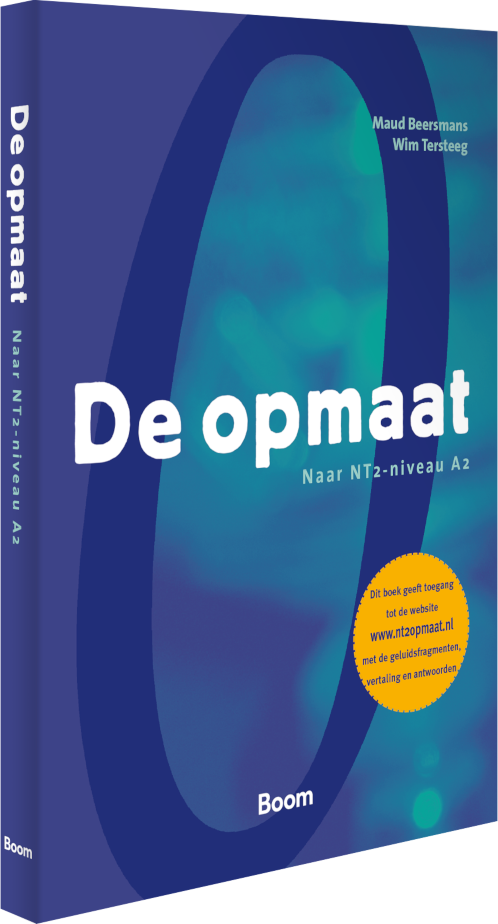
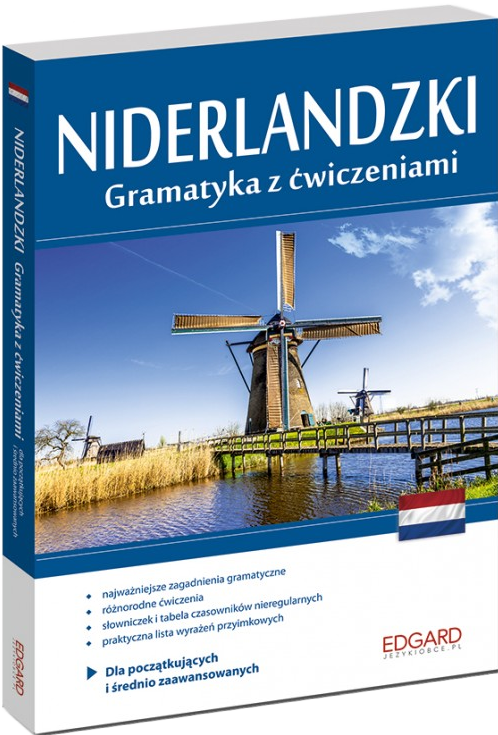
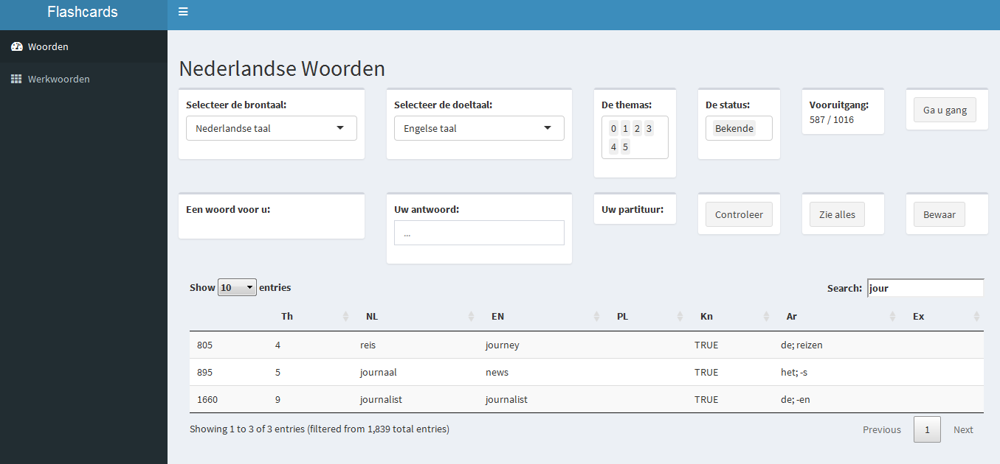
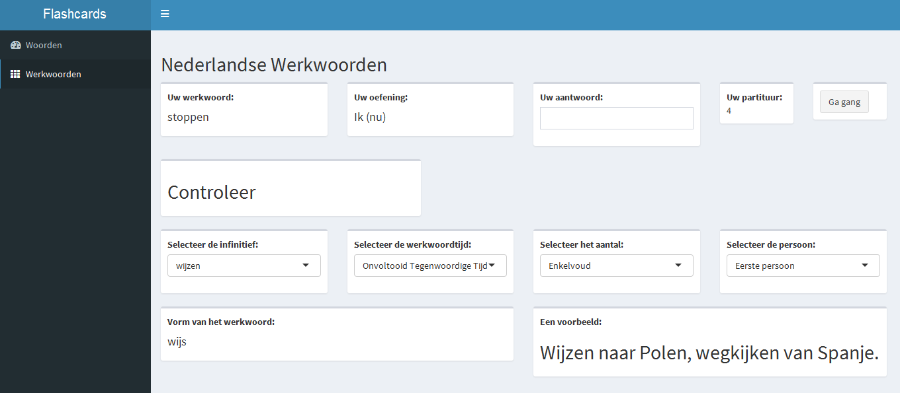

```{r setup, include=FALSE}
library(tufte)
# invalidate cache when the tufte version changes
knitr::opts_chunk$set(tidy = FALSE, cache.extra = packageVersion('tufte'))
options(htmltools.dir.version = FALSE)
```

# Introduction

When I started learning Dutch, I couldn't find an R-project to support my vocabulary memorization. So I started it myself. 

What's absurd, my goal is that I won't need them in the near future.

Maybe someone else **vindt het leuk** or is willing participate in development.

# The data

There are two data sets:

1. List of Dutch words with English translation,

Vocabulary loosely covers material from this `r newthought('Handbook')`^[[De opmaat, Naar NT2-niveau A2, Maud Beersmans, Wim Tersteeg](https://www.nt2.nl/en/100-37_De-opmaat)] and is stored in *JSON* files. The list is continuously expanded with words and expressions that I find interesting.

```{r, echo = FALSE, fig.margin = TRUE, fig.cap= "Source: www.nt2.nl"}


```


2. List of irregular Dutch verbs with conjugated forms.

The list is a compilation of above mentioned handbook and this `r newthought('book')`^[[Niderlandzki, Gramatyka z ćwiczeniami, Katarzyna Wiercińska](https://www.jezykiobce.pl/niderlandzki/1429-niderlandzki-gramatyka-z-cwiczeniami-9788377887462.html)]

```{r, echo = FALSE, fig.margin = TRUE, fig.cap= "Source: www.jezykiobce.pl"}


```

I have chosen *JSON* file format in favour of *CSV* because one word can have more then one translation (or conjugated form) or can appear in several *Themas* with a different meaning. *List* data structure is very natural to store that kind of data. 

The first dataset is a *data frame* with *lists*, the second is *data frame* of nested *data frames*. 

The structure of *woordenlijst.json* is as follows:

```{r, echo=FALSE}
library(jsonlite)
wordlist <- fromJSON(txt = "./data/woordenlijst.json")
objects <- wordlist[1:3,]
text <- toJSON(objects, pretty = T)
print(text)
```

And the structure of *woordenlijst.json* is as follows:

```{r, echo=FALSE}
library(jsonlite)
wordlist <- fromJSON(txt = "./data/werkwoorden.json")
objects <- wordlist[1,]
text <- toJSON(objects, pretty = T)
print(text)
```


# The script

Script of my Shiny application is stored in two files available from this `r newthought('Repository')`^[[https://github.com/JacekPardyak/FC](https://github.com/JacekPardyak/FC)]:

1. *ui.R*

2. *server.R*

This is the header of *ui.R* file:

```{r, echo=FALSE}
text <- readLines(con = "./ui.R", n = 10)
print(text)
```

And the header of *server.R* file:

```{r, echo=FALSE}
text <- readLines(con = "./server.R", n = 10)
print(text)
```


Shortly about the *R* libraries:

- `r newthought('shiny')`^[[https://shiny.rstudio.com/](https://shiny.rstudio.com/)] is a general framework for building web applications,

- `r newthought('shinydashboard')`^[[https://rstudio.github.io/shinydashboard/](https://rstudio.github.io/shinydashboard/)] turns Shiny applications into cool dashboards,

- `r newthought('jsonlite')`^[[https://cran.r-project.org/web/packages/jsonlite/](https://cran.r-project.org/web/packages/jsonlite/)] is used to process *JSON* files,

- `r newthought('dt')`^[[https://rstudio.github.io/DT/](https://rstudio.github.io/DT/)] is used to edit table directly in the dashboard.

# The application

As of `r Sys.Date()` my application supports:

1. Memorization of the Dutch words,

```{r, echo = FALSE}


```


2. Learning forms of irregular Dutch verbs.

```{r, echo = FALSE}


```


The usage is straightforward.


# Further work

Further I can:

- apply `r newthought('Leitner System')`^[[https://en.wikipedia.org/wiki/Leitner_system](https://en.wikipedia.org/wiki/Leitner_system)],

- add more languages (Polish or Russian), 

- expand the list with words and expressions I want to learn,

- add material I want to learn in the next level of my journey with Dutch language. 


