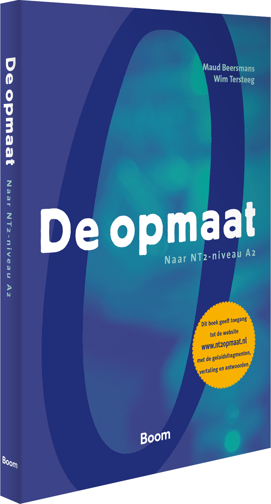
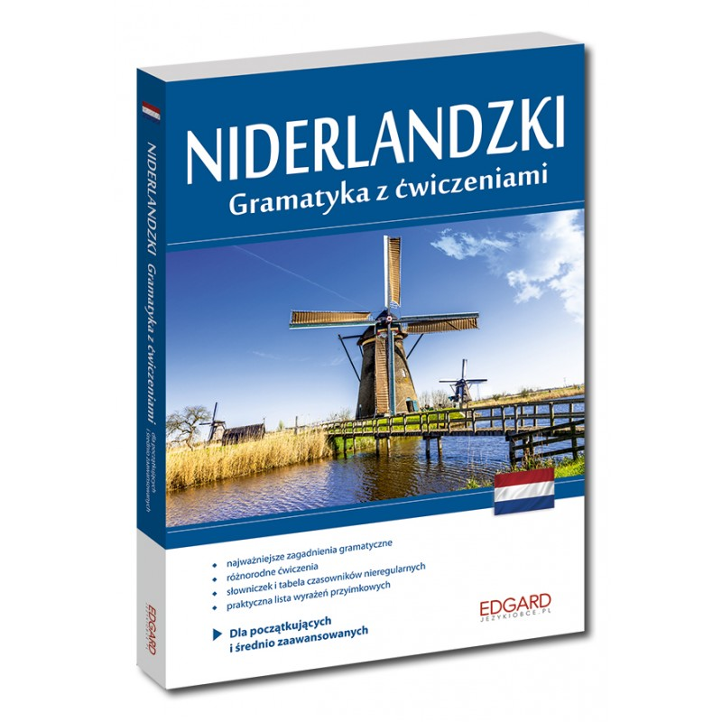

```{r setup, include=FALSE}
library(tufte)
# invalidate cache when the tufte version changes
knitr::opts_chunk$set(tidy = FALSE, cache.extra = packageVersion('tufte'))
options(htmltools.dir.version = FALSE)
```

# Introduction

When I started learning Dutch I couldn't find **R project** which will support my vocabulary memorization. So I started myself virtual `r newthought('flashcards')`^[[https://en.wikipedia.org/wiki/Flashcard](https://en.wikipedia.org/wiki/Flashcard)] project in Shiny. What is absurd, my goal is I don't need them any more in a nearly future. Maybe someone else **vindt het leuk**.

# The data

There are two data sets:

1. List of Dutch words with English translation,

Vocabulary loosely covers material from this `r newthought('Handbook')`^[[De opmaat, Naar NT2-niveau A2, Maud Beersmans, Wim Tersteeg](https://www.nt2.nl/en/100-37_De-opmaat)] and is stored in JSON files. There are also words I found interesting to me.

```{r, echo = FALSE, fig.margin = TRUE}


```


2. List of irregular Dutch verbs with conjugation forms.

The list is a compilation of above mentioned book and `r newthought('Handbook')`^[[Niderlandzki, Gramatyka z ćwiczeniami, Katarzyna Wiercińska](https://www.nt2.nl/en/100-37_De-opmaat)]

```{r, echo = FALSE, fig.margin = TRUE}


```

I have chosen *JSON* file format in favour of *CSV* because one word can have more then one translation (or conjugation form) or can appear in several *Themas* in a different context and meaning. *List* data structure is very natural to store that kind of data. The first dataset is a *data frame* with *lists*, the second is *data frame* of nested *data frames*. 

The structure of *woordenlijst.json* is as follows:

```{r, echo=FALSE, cache=TRUE}
library(jsonlite)
wordlist <- fromJSON(txt = "woordenlijst.json")
objects <- wordlist[1:3,]
text <- toJSON(objects, pretty = T)
print(text)
```

And the structure of *woordenlijst.json* is as follows:

```{r, echo=FALSE, cache=TRUE}
library(jsonlite)
wordlist <- fromJSON(txt = "werkwoorden.json")
objects <- wordlist[1,]
text <- toJSON(objects, pretty = T)
print(text)
```


JSON keys:


# The script

Script of my Shiny application is stored in two files available from this `r newthought('Repository')`^[[https://github.com/JacekPardyak/FC](https://github.com/JacekPardyak/FC)]:

1. *ui.R*

2. *server.R*

This is the header of *ui.R* file:

```{r, echo=FALSE, cache=TRUE}
text <- readLines(con = "./ui.R", n = 10)
print(text)
```

And the header of *server.R* file:

```{r, echo=FALSE, cache=TRUE}
text <- readLines(con = "./server.R", n = 10)
print(text)
```


Shortly about the *R* libraries:

- `r newthought('shiny')`^[[https://shiny.rstudio.com/](https://shiny.rstudio.com/)] is a general framework for building web applications,

- `r newthought('shinydashboard')`^[[https://rstudio.github.io/shinydashboard/](https://rstudio.github.io/shinydashboard/)] turns Shiny applications into cool dashboards,

- `r newthought('jsonlite')`^[[https://cran.r-project.org/web/packages/jsonlite/](https://cran.r-project.org/web/packages/jsonlite/)] is used to process *JSON* files,

- `r newthought('dt')`^[[https://rstudio.github.io/DT/](https://rstudio.github.io/DT/)] is used to edit table directly in the dashboard.

# The application

As of `r Sys.Date()` my application supports:

1. Memorization of the Dutch words,

2. Learning forms of irregular Dutch verbs.

The usage is straightforward.


# Further work

Further I can:

- apply `r newthought('Leitner System')`^[[https://en.wikipedia.org/wiki/Leitner_system](https://en.wikipedia.org/wiki/Leitner_system)],

- add more languages, 

- extend list of words and expressions I want to learn,

- add material I want to acquire in B1 course. 
