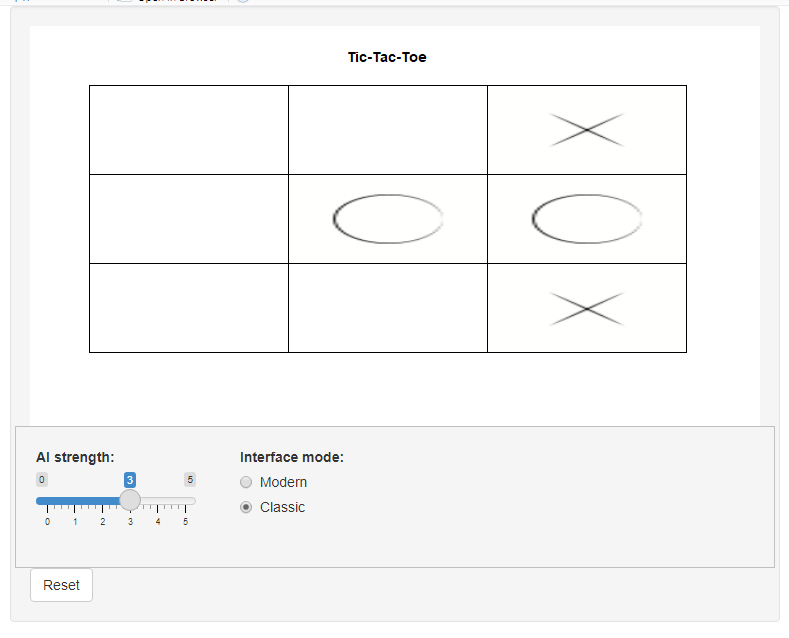
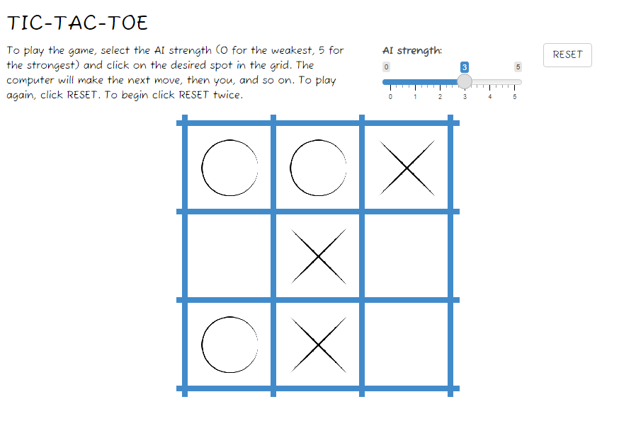

# R-cade games

## Motivation

I decided to try continuous user input in the R language - thanks to Shiny it is possible. Here is the result. 

## Pong

To play `pong` use this commands:

```
library(shiny)
runGitHub(repo = 'r-cade-games', username = 'JacekPardyak', subdir = 'pong')
```

In the app, you should see a bouncing ball resembling this:


# Tic Tac Toc

This App is an Shiny wrapper around `tictactoe` R package of Kota Mori. To play `tictactoe` use this commands:

```
library(shiny)
runGitHub(repo = 'r-cade-games', username = 'JacekPardyak', subdir = 'tictactoe')
```

On your screen you should see:



`tidy` version is available here: 

```
library(shiny)
runGitHub(repo = 'r-cade-games', username = 'JacekPardyak', subdir = 'tic-tac-toe-tidy')
```



# Animations in R

This R notebook can help you to understand the animations behind: https://github.com/JacekPardyak/r-cade-games/blob/master/Pong-animation.ipynb

# Sound in the Pong game

Files `wav` come from `beepr` package and workaround from https://stackoverflow.com/questions/62369511/how-to-make-a-shiny-app-beep-play-a-sound-after-a-reactive-event

# Further work

I can think of improving UX but my goal is achieved.

# References

https://shiny.rstudio.com/

https://github.com/rasmusab/beepr

https://github.com/kota7/tictactoe

