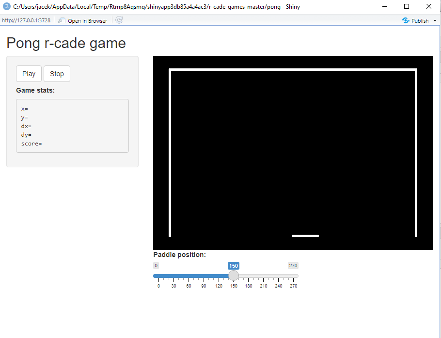

# R-cade games

## Motivation

I read a great article of Peter Prevos **R-Cade Games: Simulating the Legendary Pong Game in R** (see references). I found it really inspiring and decided to try myself go a step further - use continuous user input in the R language - thanks to Shiny it is possible. Here is the result. 

## Pong

To play `pong` use this commands:

```
library(shiny)
runGitHub(repo = 'r-cade-games', username = 'JacekPardyak', subdir = 'pong')
```

In the app, you should see a bouncing ball resembling this:



# App in the web

Test shows that the app runs well on `shiny-server` hosted on `deb-10`. 

# Animations in R

This R notebook can help you to understand the animations behind: https://github.com/JacekPardyak/r-cade-games/blob/master/Pong-animation.ipynb

# Sound in the game

Files `wav` come from `beepr` package and workaround from https://stackoverflow.com/questions/62369511/how-to-make-a-shiny-app-beep-play-a-sound-after-a-reactive-event

# Further work

I can think of improving UX but my goal is achieved.

# References

https://lucidmanager.org/data-science/pong/ 

https://github.com/rasmusab/beepr

https://shiny.rstudio.com/
